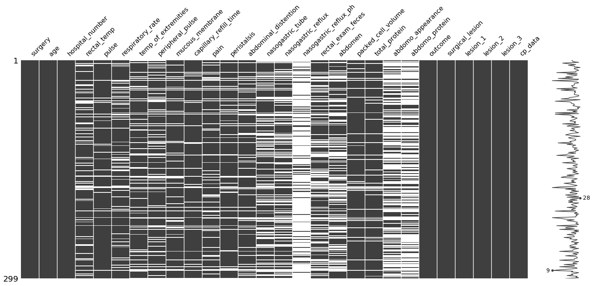
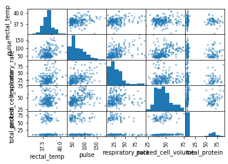
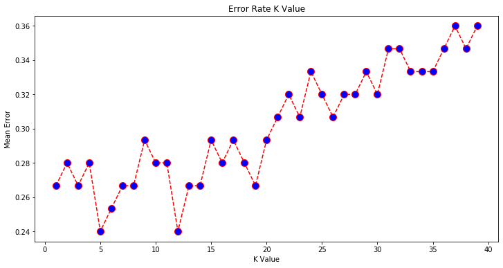
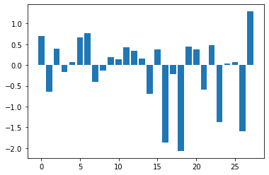
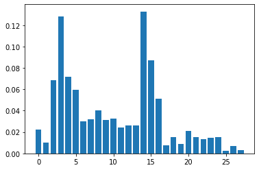
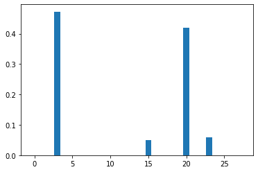

Colic can be a very serious condition in horses. If unresolved it can cause death. Having lived with horses, colic is no laughing matter. You spend hours monitoring your horse hoping to hear gut sounds, for them to poop, and an interest in eating. It is quiete nerve racking. The bond between you and your horse is very special and can span for decades. This project is obviously personal to me. Being able to predict the outcome provides me with a strange piece of comfort. 


```python
import pandas as pd
import numpy as np
import matplotlib.pyplot as plt
import seaborn as sns
import missingno as msno
from sklearn.preprocessing import OrdinalEncoder
from sklearn.model_selection import train_test_split
from sklearn.preprocessing import MinMaxScaler
from sklearn.preprocessing import StandardScaler
from sklearn.neighbors import KNeighborsClassifier
from sklearn.metrics import classification_report, confusion_matrix, accuracy_score
from sklearn.linear_model import LogisticRegression
from sklearn import metrics
from sklearn.ensemble import RandomForestClassifier
from sklearn.tree import DecisionTreeClassifier
from sklearn.ensemble import GradientBoostingClassifier
from sklearn.ensemble import AdaBoostClassifier
```


```python
colic = pd.read_csv("horse.csv")
```


```python
colic.head()
```


<div>
<style scoped>
    .dataframe tbody tr th:only-of-type {
        vertical-align: middle;
    }

    .dataframe tbody tr th {
        vertical-align: top;
    }

    .dataframe thead th {
        text-align: right;
    }
</style>
<table border="1" class="dataframe">
  <thead>
    <tr style="text-align: right;">
      <th></th>
      <th>surgery</th>
      <th>age</th>
      <th>hospital_number</th>
      <th>rectal_temp</th>
      <th>pulse</th>
      <th>respiratory_rate</th>
      <th>temp_of_extremities</th>
      <th>peripheral_pulse</th>
      <th>mucous_membrane</th>
      <th>capillary_refill_time</th>
      <th>...</th>
      <th>packed_cell_volume</th>
      <th>total_protein</th>
      <th>abdomo_appearance</th>
      <th>abdomo_protein</th>
      <th>outcome</th>
      <th>surgical_lesion</th>
      <th>lesion_1</th>
      <th>lesion_2</th>
      <th>lesion_3</th>
      <th>cp_data</th>
    </tr>
  </thead>
  <tbody>
    <tr>
      <td>0</td>
      <td>no</td>
      <td>adult</td>
      <td>530101</td>
      <td>38.5</td>
      <td>66.0</td>
      <td>28.0</td>
      <td>cool</td>
      <td>reduced</td>
      <td>NaN</td>
      <td>more_3_sec</td>
      <td>...</td>
      <td>45.0</td>
      <td>8.4</td>
      <td>NaN</td>
      <td>NaN</td>
      <td>died</td>
      <td>no</td>
      <td>11300</td>
      <td>0</td>
      <td>0</td>
      <td>no</td>
    </tr>
    <tr>
      <td>1</td>
      <td>yes</td>
      <td>adult</td>
      <td>534817</td>
      <td>39.2</td>
      <td>88.0</td>
      <td>20.0</td>
      <td>NaN</td>
      <td>NaN</td>
      <td>pale_cyanotic</td>
      <td>less_3_sec</td>
      <td>...</td>
      <td>50.0</td>
      <td>85.0</td>
      <td>cloudy</td>
      <td>2.0</td>
      <td>euthanized</td>
      <td>no</td>
      <td>2208</td>
      <td>0</td>
      <td>0</td>
      <td>no</td>
    </tr>
    <tr>
      <td>2</td>
      <td>no</td>
      <td>adult</td>
      <td>530334</td>
      <td>38.3</td>
      <td>40.0</td>
      <td>24.0</td>
      <td>normal</td>
      <td>normal</td>
      <td>pale_pink</td>
      <td>less_3_sec</td>
      <td>...</td>
      <td>33.0</td>
      <td>6.7</td>
      <td>NaN</td>
      <td>NaN</td>
      <td>lived</td>
      <td>no</td>
      <td>0</td>
      <td>0</td>
      <td>0</td>
      <td>yes</td>
    </tr>
    <tr>
      <td>3</td>
      <td>yes</td>
      <td>young</td>
      <td>5290409</td>
      <td>39.1</td>
      <td>164.0</td>
      <td>84.0</td>
      <td>cold</td>
      <td>normal</td>
      <td>dark_cyanotic</td>
      <td>more_3_sec</td>
      <td>...</td>
      <td>48.0</td>
      <td>7.2</td>
      <td>serosanguious</td>
      <td>5.3</td>
      <td>died</td>
      <td>yes</td>
      <td>2208</td>
      <td>0</td>
      <td>0</td>
      <td>yes</td>
    </tr>
    <tr>
      <td>4</td>
      <td>no</td>
      <td>adult</td>
      <td>530255</td>
      <td>37.3</td>
      <td>104.0</td>
      <td>35.0</td>
      <td>NaN</td>
      <td>NaN</td>
      <td>dark_cyanotic</td>
      <td>more_3_sec</td>
      <td>...</td>
      <td>74.0</td>
      <td>7.4</td>
      <td>NaN</td>
      <td>NaN</td>
      <td>died</td>
      <td>no</td>
      <td>4300</td>
      <td>0</td>
      <td>0</td>
      <td>no</td>
    </tr>
  </tbody>
</table>
<p>5 rows × 28 columns</p>
</div>


```python
colic.dtypes
```


    surgery                   object
    age                       object
    hospital_number            int64
    rectal_temp              float64
    pulse                    float64
    respiratory_rate         float64
    temp_of_extremities       object
    peripheral_pulse          object
    mucous_membrane           object
    capillary_refill_time     object
    pain                      object
    peristalsis               object
    abdominal_distention      object
    nasogastric_tube          object
    nasogastric_reflux        object
    nasogastric_reflux_ph    float64
    rectal_exam_feces         object
    abdomen                   object
    packed_cell_volume       float64
    total_protein            float64
    abdomo_appearance         object
    abdomo_protein           float64
    outcome                   object
    surgical_lesion           object
    lesion_1                   int64
    lesion_2                   int64
    lesion_3                   int64
    cp_data                   object
    dtype: object


## EDA

### View Missing Data


```python
# show number of rows and columns
colic.shape
```


    (299, 28)


```python
# see percentage of missing data 
colic.isnull().sum() * 100 / len(colic)
```


    surgery                   0.000000
    age                       0.000000
    hospital_number           0.000000
    rectal_temp              20.066890
    pulse                     8.026756
    respiratory_rate         19.397993
    temp_of_extremities      18.729097
    peripheral_pulse         23.076923
    mucous_membrane          15.719064
    capillary_refill_time    10.702341
    pain                     18.394649
    peristalsis              14.715719
    abdominal_distention     18.729097
    nasogastric_tube         34.782609
    nasogastric_reflux       35.451505
    nasogastric_reflux_ph    82.274247
    rectal_exam_feces        34.113712
    abdomen                  39.464883
    packed_cell_volume        9.698997
    total_protein            11.036789
    abdomo_appearance        55.183946
    abdomo_protein           66.220736
    outcome                   0.000000
    surgical_lesion           0.000000
    lesion_1                  0.000000
    lesion_2                  0.000000
    lesion_3                  0.000000
    cp_data                   0.000000
    dtype: float64


```python
%matplotlib inline
```


```python
# visualize missing data
msno.matrix(colic)
```


    <matplotlib.axes._subplots.AxesSubplot at 0x1a1b269450>


    

    


### Remove Columns

Remove columns with more than 50% missing data, lesion type, and pathology


```python
colic_2 = colic.drop(columns = ['hospital_number','nasogastric_reflux_ph', 'abdomo_appearance',
                      'abdomo_protein', 'lesion_1', 'lesion_2', 'lesion_3', 'cp_data' ])
```

### Look at Distributions


```python
df = colic_2[['rectal_temp', 'pulse', 'respiratory_rate', 'packed_cell_volume', 'total_protein']]
pd.plotting.scatter_matrix(df)
plt.show()
```


    

    


## Impute Data

### capillary_refill_time


```python
# capillary_refill_time has 3 for two values let's replace  
colic_2['capillary_refill_time'].value_counts()
```


    less_3_sec    187
    more_3_sec     78
    3               2
    Name: capillary_refill_time, dtype: int64


```python
# fill 3 in as NA
colic_2['capillary_refill_time'] = colic_2['capillary_refill_time'].replace({'3': np.nan})
```

### Impute Categorical Variables with Most Common


```python
colic_2.fillna(colic_2.select_dtypes(include = 'object').mode().iloc[0], inplace = True)
```

### Impute Numeric Variables with Median


```python
colic_2.fillna(colic_2.select_dtypes(include = 'number').median().iloc[0], inplace = True)
```

## Encode Categorical Variables


```python
# encode binary variables
colic_2['surgery'] = colic_2['surgery'].map({'yes': 1, 'no': 0})
colic_2['age'] = colic_2['age'].map({'young': 1, 'adult': 0})
colic_2['surgical_lesion'] = colic_2['surgical_lesion'].map({'yes': 1, 'no': 0})
colic_2['capillary_refill_time'] = colic_2['capillary_refill_time'].map({'more_3_sec': 1, 'less_3_sec': 0})

```


```python
# encode ordinal variables
enc = OrdinalEncoder()
colic_2[['temp_of_extremities','peripheral_pulse','pain','peristalsis']] = enc.fit_transform(colic_2[
    ['temp_of_extremities','peripheral_pulse','pain','peristalsis']]) 

colic_2[['abdominal_distention','nasogastric_tube','nasogastric_reflux','rectal_exam_feces']] = enc.fit_transform(colic_2[
    ['abdominal_distention','nasogastric_tube','nasogastric_reflux','rectal_exam_feces']])

```


```python
# encode nominal variables
colic_2 = pd.get_dummies(colic_2, prefix = ['mucous_membrane', 'abdomen'], columns = ['mucous_membrane', 'abdomen'])
```


```python
# recode euthanized as died 
colic_2['outcome'] = colic_2['outcome'].replace({'euthanized': 'died'})
```


```python
colic_2['outcome'].value_counts()
```


    lived    178
    died     121
    Name: outcome, dtype: int64


```python
colic_2.head()
```


<div>
<style scoped>
    .dataframe tbody tr th:only-of-type {
        vertical-align: middle;
    }

    .dataframe tbody tr th {
        vertical-align: top;
    }

    .dataframe thead th {
        text-align: right;
    }
</style>
<table border="1" class="dataframe">
  <thead>
    <tr style="text-align: right;">
      <th></th>
      <th>surgery</th>
      <th>age</th>
      <th>rectal_temp</th>
      <th>pulse</th>
      <th>respiratory_rate</th>
      <th>temp_of_extremities</th>
      <th>peripheral_pulse</th>
      <th>capillary_refill_time</th>
      <th>pain</th>
      <th>peristalsis</th>
      <th>...</th>
      <th>mucous_membrane_bright_red</th>
      <th>mucous_membrane_dark_cyanotic</th>
      <th>mucous_membrane_normal_pink</th>
      <th>mucous_membrane_pale_cyanotic</th>
      <th>mucous_membrane_pale_pink</th>
      <th>abdomen_distend_large</th>
      <th>abdomen_distend_small</th>
      <th>abdomen_firm</th>
      <th>abdomen_normal</th>
      <th>abdomen_other</th>
    </tr>
  </thead>
  <tbody>
    <tr>
      <td>0</td>
      <td>0</td>
      <td>0</td>
      <td>38.5</td>
      <td>66.0</td>
      <td>28.0</td>
      <td>1.0</td>
      <td>3.0</td>
      <td>1</td>
      <td>2.0</td>
      <td>0.0</td>
      <td>...</td>
      <td>0</td>
      <td>0</td>
      <td>1</td>
      <td>0</td>
      <td>0</td>
      <td>1</td>
      <td>0</td>
      <td>0</td>
      <td>0</td>
      <td>0</td>
    </tr>
    <tr>
      <td>1</td>
      <td>1</td>
      <td>0</td>
      <td>39.2</td>
      <td>88.0</td>
      <td>20.0</td>
      <td>1.0</td>
      <td>2.0</td>
      <td>0</td>
      <td>3.0</td>
      <td>0.0</td>
      <td>...</td>
      <td>0</td>
      <td>0</td>
      <td>0</td>
      <td>1</td>
      <td>0</td>
      <td>0</td>
      <td>0</td>
      <td>0</td>
      <td>0</td>
      <td>1</td>
    </tr>
    <tr>
      <td>2</td>
      <td>0</td>
      <td>0</td>
      <td>38.3</td>
      <td>40.0</td>
      <td>24.0</td>
      <td>2.0</td>
      <td>2.0</td>
      <td>0</td>
      <td>3.0</td>
      <td>2.0</td>
      <td>...</td>
      <td>0</td>
      <td>0</td>
      <td>0</td>
      <td>0</td>
      <td>1</td>
      <td>0</td>
      <td>0</td>
      <td>0</td>
      <td>1</td>
      <td>0</td>
    </tr>
    <tr>
      <td>3</td>
      <td>1</td>
      <td>1</td>
      <td>39.1</td>
      <td>164.0</td>
      <td>84.0</td>
      <td>0.0</td>
      <td>2.0</td>
      <td>1</td>
      <td>1.0</td>
      <td>0.0</td>
      <td>...</td>
      <td>0</td>
      <td>1</td>
      <td>0</td>
      <td>0</td>
      <td>0</td>
      <td>1</td>
      <td>0</td>
      <td>0</td>
      <td>0</td>
      <td>0</td>
    </tr>
    <tr>
      <td>4</td>
      <td>0</td>
      <td>0</td>
      <td>37.3</td>
      <td>104.0</td>
      <td>35.0</td>
      <td>1.0</td>
      <td>2.0</td>
      <td>1</td>
      <td>3.0</td>
      <td>2.0</td>
      <td>...</td>
      <td>0</td>
      <td>1</td>
      <td>0</td>
      <td>0</td>
      <td>0</td>
      <td>1</td>
      <td>0</td>
      <td>0</td>
      <td>0</td>
      <td>0</td>
    </tr>
  </tbody>
</table>
<p>5 rows × 29 columns</p>
</div>


## Train/ Test Split


```python
# get x and y
y = colic_2['outcome'].copy()
X = colic_2.drop('outcome', axis = 1).copy()
```


```python
# split into training and testing
x_train, x_test, y_train, y_test = train_test_split(X, y, random_state = 4, stratify=y)
```

## Standardize


```python
# copy of datasets
X_train_stand = x_train.copy()
X_test_stand = x_test.copy()

# numerical features
num_cols = ['rectal_temp','pulse','respiratory_rate',
            'packed_cell_volume','total_protein']

# apply standardization on numerical features
for i in num_cols:
    
    # fit on training data column
    scale = StandardScaler().fit(X_train_stand[[i]])
    
    # transform the training data column
    X_train_stand[i] = scale.transform(X_train_stand[[i]])
    
    # transform the testing data column
    X_test_stand[i] = scale.transform(X_test_stand[[i]])
```


```python
y_test.value_counts()/ 75
```


    lived    0.6
    died     0.4
    Name: outcome, dtype: float64


## kNN


```python
kNN_classifier = KNeighborsClassifier(n_neighbors=5)
kNN_classifier.fit(X_train_stand, y_train)
```


    KNeighborsClassifier(algorithm='auto', leaf_size=30, metric='minkowski',
                         metric_params=None, n_jobs=None, n_neighbors=5, p=2,
                         weights='uniform')


```python
y_pred = kNN_classifier.predict(X_test_stand)
```


```python
print(confusion_matrix(y_test, y_pred))
```

    [[20 10]
     [ 8 37]]


```python
print(classification_report(y_test, y_pred))
print(accuracy_score(y_test, y_pred))
```

                  precision    recall  f1-score   support
    
            died       0.71      0.67      0.69        30
           lived       0.79      0.82      0.80        45
    
        accuracy                           0.76        75
       macro avg       0.75      0.74      0.75        75
    weighted avg       0.76      0.76      0.76        75
    
    0.76


```python
error = []

# Calculating error for K values between 1 and 40
for i in range(1, 40):
    knn = KNeighborsClassifier(n_neighbors=i)
    knn.fit(X_train_stand, y_train)
    pred_i = knn.predict(X_test_stand)
    error.append(np.mean(pred_i != y_test))
```


```python
plt.figure(figsize=(12, 6))
plt.plot(range(1, 40), error, color='red', linestyle='dashed', marker='o',
         markerfacecolor='blue', markersize=10)
plt.title('Error Rate K Value')
plt.xlabel('K Value')
plt.ylabel('Mean Error')
```


    Text(0, 0.5, 'Mean Error')


    

    


## Logistic Regression


```python
logistic_regression = LogisticRegression(solver = 'liblinear', C = 10.0)
```


```python
logistic_regression.fit(X_train_stand, y_train)
```


    LogisticRegression(C=10.0, class_weight=None, dual=False, fit_intercept=True,
                       intercept_scaling=1, l1_ratio=None, max_iter=100,
                       multi_class='warn', n_jobs=None, penalty='l2',
                       random_state=None, solver='liblinear', tol=0.0001, verbose=0,
                       warm_start=False)


```python
y_pred = logistic_regression.predict(X_test_stand)
```


```python
print(confusion_matrix(y_test, y_pred))
```

    [[19 11]
     [11 34]]


```python
print(classification_report(y_test, y_pred))
print(accuracy_score(y_test, y_pred))
```

                  precision    recall  f1-score   support
    
            died       0.63      0.63      0.63        30
           lived       0.76      0.76      0.76        45
    
        accuracy                           0.71        75
       macro avg       0.69      0.69      0.69        75
    weighted avg       0.71      0.71      0.71        75
    
    0.7066666666666667


```python
# get importance
log_importance = logistic_regression.coef_[0]
for i,v in enumerate(log_importance):
	print('Feature: %0d, Score: %.5f' % (i,v))
plt.bar([x for x in range(len(log_importance))], log_importance)
plt.show()
```

    Feature: 0, Score: 0.70703
    Feature: 1, Score: -0.64943
    Feature: 2, Score: 0.39104
    Feature: 3, Score: -0.16302
    Feature: 4, Score: 0.06543
    Feature: 5, Score: 0.66687
    Feature: 6, Score: 0.76002
    Feature: 7, Score: -0.40463
    Feature: 8, Score: -0.13217
    Feature: 9, Score: 0.18413
    Feature: 10, Score: 0.14195
    Feature: 11, Score: 0.42755
    Feature: 12, Score: 0.34120
    Feature: 13, Score: 0.16258
    Feature: 14, Score: -0.70335
    Feature: 15, Score: 0.37598
    Feature: 16, Score: -1.87108
    Feature: 17, Score: -0.21127
    Feature: 18, Score: -2.07048
    Feature: 19, Score: 0.43800
    Feature: 20, Score: 0.38053
    Feature: 21, Score: -0.59329
    Feature: 22, Score: 0.47103
    Feature: 23, Score: -1.38284
    Feature: 24, Score: 0.03199
    Feature: 25, Score: 0.07698
    Feature: 26, Score: -1.60154
    Feature: 27, Score: 1.28994


    

    


## Random Forest


```python
rf_classifier = RandomForestClassifier(n_estimators=100, max_features = 'log2', random_state=65)
rf_classifier.fit(X_train_stand, y_train)
rf_y_pred = rf_classifier.predict(X_test_stand)
```


```python
print(confusion_matrix(y_test,rf_y_pred))
print(classification_report(y_test,rf_y_pred))
print(accuracy_score(y_test, rf_y_pred))
```

    [[20 10]
     [ 9 36]]
                  precision    recall  f1-score   support
    
            died       0.69      0.67      0.68        30
           lived       0.78      0.80      0.79        45
    
        accuracy                           0.75        75
       macro avg       0.74      0.73      0.73        75
    weighted avg       0.75      0.75      0.75        75
    
    0.7466666666666667


```python
rf_importance = rf_classifier.feature_importances_
for i,v in enumerate(rf_importance):
	print('Feature: %0d, Score: %.5f' % (i,v))
plt.bar([x for x in range(len(rf_importance))], rf_importance)
plt.show()
```

    Feature: 0, Score: 0.02261
    Feature: 1, Score: 0.01023
    Feature: 2, Score: 0.06852
    Feature: 3, Score: 0.12848
    Feature: 4, Score: 0.07186
    Feature: 5, Score: 0.05947
    Feature: 6, Score: 0.03021
    Feature: 7, Score: 0.03208
    Feature: 8, Score: 0.04038
    Feature: 9, Score: 0.03116
    Feature: 10, Score: 0.03260
    Feature: 11, Score: 0.02397
    Feature: 12, Score: 0.02613
    Feature: 13, Score: 0.02612
    Feature: 14, Score: 0.13294
    Feature: 15, Score: 0.08746
    Feature: 16, Score: 0.05133
    Feature: 17, Score: 0.00781
    Feature: 18, Score: 0.01525
    Feature: 19, Score: 0.00893
    Feature: 20, Score: 0.02126
    Feature: 21, Score: 0.01552
    Feature: 22, Score: 0.01312
    Feature: 23, Score: 0.01484
    Feature: 24, Score: 0.01537
    Feature: 25, Score: 0.00214
    Feature: 26, Score: 0.00695
    Feature: 27, Score: 0.00324


    

    


## Decision Tree


```python
dt_classifier = DecisionTreeClassifier(max_depth=None, max_leaf_nodes=6, max_features=3, random_state=30)
dt_classifier.fit(X_train_stand, y_train)
dt_y_pred = dt_classifier.predict(X_test_stand)
```


```python
print(confusion_matrix(y_test,dt_y_pred))
print(classification_report(y_test,dt_y_pred))
print(accuracy_score(y_test, dt_y_pred))
```

    [[14 16]
     [ 6 39]]
                  precision    recall  f1-score   support
    
            died       0.70      0.47      0.56        30
           lived       0.71      0.87      0.78        45
    
        accuracy                           0.71        75
       macro avg       0.70      0.67      0.67        75
    weighted avg       0.71      0.71      0.69        75
    
    0.7066666666666667


```python
dt_importance = dt_classifier.feature_importances_
for i,v in enumerate(dt_importance):
	print('Feature: %0d, Score: %.5f' % (i,v))
plt.bar([x for x in range(len(dt_importance))], dt_importance)
plt.show()
```

    Feature: 0, Score: 0.00000
    Feature: 1, Score: 0.00000
    Feature: 2, Score: 0.00000
    Feature: 3, Score: 0.47272
    Feature: 4, Score: 0.00000
    Feature: 5, Score: 0.00000
    Feature: 6, Score: 0.00000
    Feature: 7, Score: 0.00000
    Feature: 8, Score: 0.00000
    Feature: 9, Score: 0.00000
    Feature: 10, Score: 0.00000
    Feature: 11, Score: 0.00000
    Feature: 12, Score: 0.00000
    Feature: 13, Score: 0.00000
    Feature: 14, Score: 0.00000
    Feature: 15, Score: 0.04976
    Feature: 16, Score: 0.00000
    Feature: 17, Score: 0.00000
    Feature: 18, Score: 0.00000
    Feature: 19, Score: 0.00000
    Feature: 20, Score: 0.41939
    Feature: 21, Score: 0.00000
    Feature: 22, Score: 0.00000
    Feature: 23, Score: 0.05814
    Feature: 24, Score: 0.00000
    Feature: 25, Score: 0.00000
    Feature: 26, Score: 0.00000
    Feature: 27, Score: 0.00000


    

    


## Gradient Boosted Trees


```python
model = GradientBoostingClassifier(n_estimators = 100, max_features="sqrt", random_state=30)
model.fit(X_train_stand, y_train)
gb_y_pred = model.predict(X_test_stand)
```


```python
print(confusion_matrix(y_test,gb_y_pred))
print(classification_report(y_test,gb_y_pred))
print(accuracy_score(y_test, gb_y_pred))
```

    [[20 10]
     [ 7 38]]
                  precision    recall  f1-score   support
    
            died       0.74      0.67      0.70        30
           lived       0.79      0.84      0.82        45
    
        accuracy                           0.77        75
       macro avg       0.77      0.76      0.76        75
    weighted avg       0.77      0.77      0.77        75
    
    0.7733333333333333


Overall I'm happy with how my models performed. I'm working on improving my python and ML, so this was a nice way to get my feet wet. 
